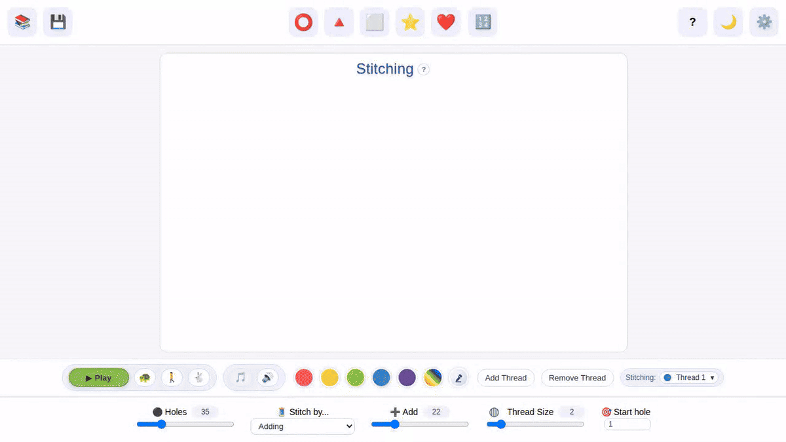

# StitchLab What's New

Feature highlights captured from scripted Playwright interactions.

Generated: 2026-09-23T10:30:17.908Z

## List stitch mode: hole sequence or addition steps

You now have two ways to stitch a thread with a list of values. Set the list type to "holes" to treat each possible consecutive ordered pair as a connection, or set the list type to "steps" to calculate each connection by adding the given value from the list, progressing one by one through it.

## Onboarding autoplay tutorial

When you open StitchLab for the first time, or without any URL parameters, a spoken tutorial will start by default.

## Paramless random thread startup preview

When you open StitchLab for the first time, or with no URL parameters, a random single-thread pattern will be generated.

## Hole number rotation remapping

Now you can rotate your patterns by rotating the hole numbers on a stitching frame.

## Active thread configuration overlay

When your pattern has more than one thread, StitchLab will show the config values for each active thread during stitch animation.

## Formula stitch mode improvements

Formula mode returns! You can use basic operators and expressions to tell StitchLab how to calculate each target hole for your thread connections.

## Stitch library workflow

Finally you can save your Stitching patterns, and load them again whenever you like!

## Curve sewing cards viewer

Thanks to Cambridge Library, we now have images of the original sewing cards created by Mary Everest Boole!

